<div align="center">


<br/>

<a href="https://github.com/eyupcodes">
  
</a>

<!-- Replace the four URLs below with your own profile links. -->
<a href="YOUR_LINKEDIN_URL">
  
</a>
<a href="YOUR_MEDIUM_URL">
  
</a>
<a href="YOUR_KAGGLE_URL">
  
</a>
<a href="YOUR_HUGGINGFACE_URL">
  
</a>
<a href="YOUR_SLACK_URL">
  
</a>

<br/><br/>


</div>

---

## `> whoami`

```python
class EyupFidan:
    role = "Software Developer"

    main_direction = [
        "Artificial Intelligence",
        "Machine Learning",
        "Data",
        "Software Engineering",
    ]

    currently_exploring = [
        "RAG Systems",
        "LLM Evaluation",
        "AI Agents",
        "Model Benchmarking",
        "Data Engineering",
        "Automation",
    ]

    primary_language = "Python"

    additional_stack = [
        "JavaScript",
        "TypeScript",
        "React",
        "Next.js",
        "Jupyter",
    ]

    currently_learning = [
        "C++",
        "R",
    ]

    approach = "Build → Test → Measure → Learn → Improve → Ship"
```

I am building my technical foundation around **AI, machine learning, data and software systems**.

My goal is not to fill GitHub with disconnected tutorial repositories. I use it as a public engineering workspace where I can turn concepts into measurable experiments, tools, applications and increasingly complete systems.

I am especially interested in the layer between **AI research concepts and usable software**: retrieval systems, evaluation, model tooling, automation, data flows and the engineering required to make these systems reliable.

---

## 🧭 What I’m Working Toward

<table>
<tr>
<td width="25%" align="center">

### 🤖 AI Systems

LLMs  
RAG  
Agents  
Evaluation  

</td>
<td width="25%" align="center">

### 📊 Data

Processing  
Pipelines  
Analytics  
Experiments  

</td>
<td width="25%" align="center">

### 🧱 Software

Architecture  
Backend  
Web  
Testing  

</td>
<td width="25%" align="center">

### ⚙️ Engineering

Automation  
CI/CD  
Observability  
Tooling  

</td>
</tr>
</table>

The long-term direction is simple:

```text
Foundations
    ↓
Applied Projects
    ↓
Evaluation & Measurement
    ↓
Data + Backend Systems
    ↓
Automation + CI/CD
    ↓
Reliable AI-Powered Software
```

---

## 🧠 Areas of Interest

Rather than treating every technology as an isolated skill, I am trying to understand how the pieces interact inside complete systems.

```text
Artificial Intelligence
├── Large Language Models
├── Retrieval-Augmented Generation
├── AI Agents
├── Model Evaluation
├── Prompt Evaluation
├── Tool-Using Systems
└── Human-in-the-Loop Workflows

Machine Learning
├── Applied ML
├── Model Evaluation
├── Experiment Design
├── Metrics
├── Reproducibility
└── Benchmarking

Data
├── Data Processing
├── Data Pipelines
├── Analytics
├── Data Quality
├── Structured Experiments
└── Data Engineering Foundations

Software Engineering
├── Python Systems
├── Backend Architecture
├── Web Applications
├── APIs
├── Testing
├── CI/CD
├── Automation
└── Maintainability
```

---

## 🧰 Technology Stack

> Every icon below links to the technology's official website or documentation.

### Languages

<p align="center">
  <a href="https://www.python.org/" title="Python">
    
  </a>
  <a href="https://developer.mozilla.org/en-US/docs/Web/JavaScript" title="JavaScript">
    
  </a>
  <a href="https://www.typescriptlang.org/" title="TypeScript">
    
  </a>
  <a href="https://developer.mozilla.org/en-US/docs/Web/HTML" title="HTML">
    
  </a>
  <a href="https://developer.mozilla.org/en-US/docs/Web/CSS" title="CSS">
    
  </a>
</p>

### Currently Learning / Expanding Into

<p align="center">
  <a href="https://isocpp.org/" title="C++">
    
  </a>
  <a href="https://www.r-project.org/" title="R">
    
  </a>
</p>

<p align="center">
  <sub>C++ for performance-oriented systems and AI infrastructure • R for statistics, data analysis and research workflows</sub>
</p>

### Frontend & Web

<p align="center">
  <a href="https://react.dev/" title="React">
    
  </a>
  <a href="https://nextjs.org/" title="Next.js">
    
  </a>
  <a href="https://nodejs.org/" title="Node.js">
    
  </a>
  <a href="https://vite.dev/" title="Vite">
    
  </a>
</p>

### AI & Data

<p align="center">
  <a href="https://pytorch.org/" title="PyTorch">
    
  </a>
  <a href="https://www.tensorflow.org/" title="TensorFlow">
    
  </a>
  <a href="https://scikit-learn.org/" title="scikit-learn">
    
  </a>
</p>

<p align="center">
  <a href="https://jupyter.org/" title="Jupyter">
    
  </a>
  <a href="https://pandas.pydata.org/" title="Pandas">
    
  </a>
  <a href="https://numpy.org/" title="NumPy">
    
  </a>
</p>

### Engineering & Infrastructure

<p align="center">
  <a href="https://git-scm.com/" title="Git">
    
  </a>
  <a href="https://github.com/" title="GitHub">
    
  </a>
  <a href="https://www.docker.com/" title="Docker">
    
  </a>
  <a href="https://www.kernel.org/" title="Linux">
    
  </a>
  <a href="https://supabase.com/" title="Supabase">
    
  </a>
  <a href="https://vercel.com/" title="Vercel">
    
  </a>
  <a href="https://code.visualstudio.com/" title="Visual Studio Code">
    
  </a>
</p>

---

## 🏢 ATKA Studio

<div align="center">

### Premium websites, digital systems & custom automation

I’m also building **ATKA Studio** — a digital studio focused on creating polished web experiences, practical digital systems and custom-built solutions for modern businesses.

<br/>

<a href="https://atka.studio">
  
</a>

<br/><br/>

`Premium Websites` • `Digital Systems` • `Automation` • `Custom Builds`

</div>

> ATKA is where I apply software, product thinking and design beyond standalone repositories — turning technical capability into client-facing digital products.

---

## 🚀 Selected Projects

<table>
<tr>
<td width="50%" valign="top">

### 🔎 RAGBench

A benchmarking-oriented project focused on retrieval-augmented generation and retrieval quality.

**What it represents**
- Retrieval evaluation
- Reproducible benchmarks
- Test-driven iteration
- Python engineering
- Measurement before assumptions

<a href="https://github.com/eyupcodes/RAGBench">
  
</a>

</td>

<td width="50%" valign="top">

### 📏 ModelMeter

A model-oriented engineering project built around structured AI model measurement and comparison.

**What it represents**
- Model benchmarking
- Comparative evaluation
- Metrics
- Experiment structure
- AI tooling

<a href="https://github.com/eyupcodes/ModelMeter">
  
</a>

</td>
</tr>

<tr>
<td width="50%" valign="top">

### 🧪 Prompt Bench

Experiments and tooling for evaluating prompt behavior in a more structured and reproducible way.

**What it represents**
- Prompt testing
- LLM experimentation
- Comparative evaluation
- Reproducibility
- Technical iteration

</td>

<td width="50%" valign="top">

### 🧱 Product & System Projects

Larger projects where the challenge is not only writing code, but combining architecture, workflows, AI, data, backend logic and product constraints.

**What they represent**
- System design
- Modular architecture
- AI integration
- Workflow engineering
- End-to-end thinking

</td>
</tr>
</table>

---

## 🔬 Research & Technical Writing

### Prompt Engineering in Large Language Models

I have worked on academic research around **prompt engineering in large language models**, covering methods, applications and ethical considerations.

That work is part of why I am increasingly interested in going beyond isolated prompts and focusing on broader questions such as:

- How should an LLM system be evaluated?
- How do we measure retrieval quality?
- When does an agent architecture actually improve a workflow?
- How should AI systems fail safely?
- How can experiments remain reproducible?
- Which improvements are measurable and which are only subjective?

This is also where **Medium** fits into the profile: technical notes, experiments, lessons learned and deeper write-ups can live there without turning every GitHub repository into a long-form article.

---

## 🧪 How I Think About Engineering

```text
Problem
  ↓
Assumptions
  ↓
Smallest useful architecture
  ↓
Critical implementation path
  ↓
Tests
  ↓
Measurement
  ↓
Failure analysis
  ↓
Documentation
  ↓
Automation
  ↓
Iteration
```

A technically impressive system is not automatically a good system.

I care increasingly about whether a project is:

- **understandable** enough to maintain,
- **testable** enough to trust,
- **measurable** enough to evaluate,
- **modular** enough to evolve,
- **documented** enough to survive context loss,
- and **useful** enough to justify its complexity.

---

## 📐 Engineering Principles

| Principle | What it means to me |
|---|---|
| **Build** | Concepts become valuable when they are implemented |
| **Measure** | Improvement without measurement is mostly guesswork |
| **Test** | Reliability should be designed into the system |
| **Simplify** | Complexity needs a concrete reason to exist |
| **Document** | Important technical decisions should remain understandable |
| **Automate** | Repetitive verification should become tooling |
| **Iterate** | Version one is a starting point, not the architecture forever |
| **Ship** | Finished systems create better feedback than endless drafts |

---

## 📊 GitHub Intelligence

<div align="center">

<picture>
  <source media="(prefers-color-scheme: dark)" srcset="./assets/overview.dark.svg" />
  <source media="(prefers-color-scheme: light)" srcset="./assets/overview.light.svg" />
  
</picture>

<br/><br/>

<picture>
  <source media="(prefers-color-scheme: dark)" srcset="./assets/languages.dark.svg" />
  <source media="(prefers-color-scheme: light)" srcset="./assets/languages.light.svg" />
  
</picture>

</div>

> These cards are generated inside this repository through GitHub Actions.

---

## 📈 Activity Rhythm

Instead of repeating contribution counts in multiple charts, this section keeps only one view that answers a different question: **when do I tend to build?**

<div align="center">

<picture>
  <source media="(prefers-color-scheme: dark)" srcset="./assets/rhythm.dark.svg" />
  <source media="(prefers-color-scheme: light)" srcset="./assets/rhythm.light.svg" />
  
</picture>

</div>

---

## 🐍 Contribution Snake

<div align="center">

<picture>
  <source media="(prefers-color-scheme: dark)" srcset="https://raw.githubusercontent.com/eyupcodes/eyupcodes/output/github-contribution-grid-snake-dark.svg" />
  <source media="(prefers-color-scheme: light)" srcset="https://raw.githubusercontent.com/eyupcodes/eyupcodes/output/github-contribution-grid-snake.svg" />
  
</picture>

</div>

---

## 🗺️ Learning & Development Map

My current learning path is not a single straight line. It is a layered system where each area supports the others.

```text
                     ┌─────────────────────┐
                     │  Computer Science   │
                     └──────────┬──────────┘
                                ↓
                     ┌─────────────────────┐
                     │ Python + Algorithms │
                     └──────────┬──────────┘
                                ↓
          ┌─────────────────────┼─────────────────────┐
          ↓                     ↓                     ↓
    Mathematics          Machine Learning       Data Systems
          ↓                     ↓                     ↓
          └──────────────┬──────┴──────┬──────────────┘
                         ↓             ↓
                       LLMs           RAG
                         └──────┬──────┘
                                ↓
                         AI Applications
                                ↓
                    Backend + Architecture
                                ↓
                  Testing + CI/CD + Security
                                ↓
                     Production-Oriented
                        Software Systems
```

The point is not to rush through this map. The point is to build enough depth that later projects are based on understanding rather than copy-paste implementation.

---

## 🧩 Capability Areas I’m Developing

| Area | Direction |
|---|---|
| **Python** | Core programming, tooling, automation, backend |
| **Machine Learning** | Foundations, experimentation, evaluation |
| **LLMs** | RAG, prompts, evaluation, agents |
| **Data** | Processing, pipelines, analytics, quality |
| **JavaScript / TypeScript** | Web and product development |
| **Architecture** | Modular systems, boundaries, maintainability |
| **Testing** | Unit, integration, reproducible evaluation |
| **CI/CD** | Automated verification and delivery workflows |
| **Infrastructure** | Docker, Linux and deployment foundations |
| **C++** | Performance-oriented programming and AI/system foundations |
| **R** | Statistics, data analysis and research workflows |
| **Research** | Reading, experimentation and technical writing |

---

## 🎯 Current Objectives

```yaml
current_objectives:
  foundations:
    - strengthen computer science fundamentals
    - improve algorithms and problem solving
    - deepen mathematics for ML

  ai_ml:
    - strengthen machine learning foundations
    - build better RAG systems
    - learn evaluation methodology
    - explore practical agent architectures

  data:
    - improve data engineering foundations
    - work with larger and cleaner data workflows
    - learn pipeline and quality practices

  software:
    - deepen Python engineering
    - expand JavaScript and TypeScript project depth
    - improve architecture and testing discipline

  production:
    - use CI/CD consistently
    - improve observability
    - improve security awareness
    - design for maintainability
```

---

## 🗂️ What You’ll Find Across My Repositories

```text
📦 AI / LLM experiments
📦 RAG and retrieval systems
📦 Machine learning projects
📦 Model and prompt benchmarks
📦 Data-oriented notebooks
📦 Python tools and automation
📦 JavaScript / TypeScript applications
📦 Evaluation utilities
📦 CI-tested engineering projects
📦 Larger product-oriented experiments
```

Some repositories are deliberately small because they isolate one concept. Others are larger because the goal is to practice architecture and system design.

The important distinction for me is whether a repository has a clear technical purpose.

---

## 🌐 Find Me Elsewhere

<div align="center">

<!-- Replace these placeholder links with your real accounts. -->

<a href="YOUR_LINKEDIN_URL">
  
</a>

<a href="YOUR_MEDIUM_URL">
  
</a>

<a href="YOUR_KAGGLE_URL">
  
</a>

<a href="YOUR_HUGGINGFACE_URL">
  
</a>

<a href="YOUR_SLACK_URL">
  
</a>

</div>

<br/>

- **LinkedIn** — professional profile, networking and project updates
- **Medium** — technical writing, research notes and deeper explanations
- **Kaggle** — datasets, notebooks, experiments and data/ML work
- **Hugging Face** — models, Spaces, datasets and AI experiments
- **Slack** — communities, collaboration and technical networking
- **GitHub** — source code, engineering projects and technical experiments

---

## `> system.status`

```yaml
name: Eyüp Fidan
role: Software Developer

direction:
  - Artificial Intelligence
  - Machine Learning
  - Data
  - Software Engineering

primary_language: Python

building:
  - RAG systems
  - evaluation tooling
  - AI experiments
  - automation
  - data projects
  - software systems

operating_principles:
  - understand
  - build
  - test
  - measure
  - document
  - improve
  - ship
```

---

<div align="center">

### `BUILD → TEST → MEASURE → LEARN → IMPROVE → SHIP`

<br/>

**AI • Machine Learning • Data • Software Systems**

<br/><br/>

<a href="https://github.com/eyupcodes?tab=repositories">
  
</a>

<br/><br/>


</div>
