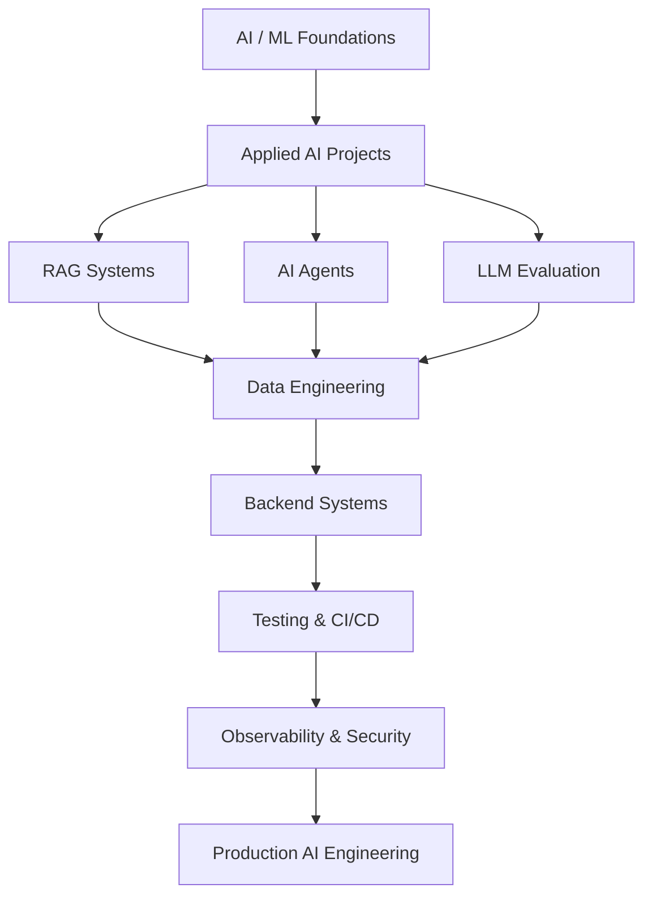

<div align="center">


<br/>

<a href="https://github.com/eyupcodes">
  
</a>


<br/><br/>


</div>

---

## `> identity --verbose`

```python
class EyupFidan:
    role = "Software Developer"

    primary_direction = [
        "AI Engineering",
        "Machine Learning",
        "Data Engineering",
        "Software Engineering",
    ]

    deepening_into = [
        "RAG Systems",
        "LLM Evaluation",
        "AI Agents",
        "Model Benchmarking",
        "Automation",
        "Production AI",
    ]

    main_language = "Python"

    additional_stack = [
        "JavaScript",
        "TypeScript",
        "React",
        "Next.js",
        "Jupyter",
    ]

    engineering_style = [
        "build",
        "measure",
        "test",
        "document",
        "iterate",
        "ship",
    ]

    long_term_goal = "Build reliable AI-powered systems, not isolated demos."
```

I focus on the intersection of **AI, data and software engineering**.

This GitHub profile is my engineering workspace and public portfolio: a place for benchmarks, experiments, tools, systems and product-oriented projects that demonstrate how I approach real technical problems.

---

## 🧠 Core Engineering Direction

<table>
<tr>
<td width="25%" align="center">

### 🤖 AI
LLMs  
RAG  
Agents  
Evaluation  

</td>
<td width="25%" align="center">

### 📊 Data
Pipelines  
Processing  
Analytics  
Experiments  

</td>
<td width="25%" align="center">

### 🧱 Software
Architecture  
Backend  
Web Systems  
Testing  

</td>
<td width="25%" align="center">

### ⚙️ Systems
Automation  
CI/CD  
Observability  
Tooling  

</td>
</tr>
</table>

---

## ⚡ What I’m Building Toward

```text
┌──────────────────────────────────────────────────────────────┐
│                    PRODUCTION AI ENGINEERING                 │
├──────────────────────────────────────────────────────────────┤
│  LLM Systems  │  RAG  │  Agents  │  Evaluation  │  Data    │
├──────────────────────────────────────────────────────────────┤
│      Backend Systems  │  Automation  │  Testing  │  CI/CD    │
├──────────────────────────────────────────────────────────────┤
│           Architecture  │  Observability  │  Security        │
└──────────────────────────────────────────────────────────────┘
```

The goal is not to collect technologies.  
The goal is to understand how they fit together inside **reliable, measurable and maintainable systems**.

---

## 🧰 Technology Stack

### Languages

<p align="center">
  
</p>

### Frontend & Web

<p align="center">
  
</p>

### AI & Data

<p align="center">
  
</p>

<p align="center">
  
  
  
</p>

### Engineering & Infrastructure

<p align="center">
  
</p>

---

## 🚀 Selected Engineering Projects

<table>
<tr>
<td width="50%" valign="top">

### 🔎 RAGBench

Benchmarking-oriented project for testing and evaluating retrieval-augmented generation components and retrieval quality.

**Engineering focus**
- Retrieval evaluation
- Benchmark design
- Reproducible testing
- Quality measurement
- Python tooling

<a href="https://github.com/eyupcodes/RAGBench">
  
</a>

</td>

<td width="50%" valign="top">

### 📏 ModelMeter

Model evaluation project focused on comparing AI model behavior and performance through structured measurement.

**Engineering focus**
- Model benchmarking
- Comparative evaluation
- Metrics
- Experiment design
- Python

<a href="https://github.com/eyupcodes/ModelMeter">
  
</a>

</td>
</tr>

<tr>
<td width="50%" valign="top">

### 🧪 Prompt Bench

Prompt evaluation and experimentation tooling for testing prompt behavior across structured scenarios.

**Engineering focus**
- Prompt evaluation
- LLM experimentation
- Reproducibility
- Comparative testing
- Benchmarking

</td>

<td width="50%" valign="top">

### 🧱 Product & System Projects

Larger software projects that combine architecture, AI, backend systems, automation and product thinking.

**Engineering focus**
- Modular architecture
- Workflow design
- AI integration
- Testing
- Product engineering

</td>
</tr>
</table>

---

## 🧪 Research & Technical Interests

```text
LLM Evaluation
│
├── Prompt Evaluation
├── Model Comparison
├── Retrieval Quality
├── RAG Benchmarking
├── Agent Evaluation
└── Reliability / Reproducibility

Applied AI
│
├── AI Assistants
├── AI Agents
├── Tool-Using Systems
├── Automation
├── Multi-Model Workflows
└── Human-in-the-Loop Systems

Data & Systems
│
├── Data Pipelines
├── Processing
├── Backend Architecture
├── CI/CD
├── Observability
└── Production Readiness
```

---

## 📚 Research Work

### Prompt Engineering in Large Language Models

I have worked on academic research around **prompt engineering in large language models**, including methods, applications and ethical considerations.

My technical interests increasingly focus on moving from prompt-level experimentation toward **system-level AI evaluation and engineering**.

---

## 📊 GitHub Intelligence

<div align="center">

<picture>
  <source media="(prefers-color-scheme: dark)" srcset="./assets/overview.dark.svg" />
  <source media="(prefers-color-scheme: light)" srcset="./assets/overview.light.svg" />
  
</picture>

<br/><br/>

<picture>
  <source media="(prefers-color-scheme: dark)" srcset="./assets/languages.dark.svg" />
  <source media="(prefers-color-scheme: light)" srcset="./assets/languages.light.svg" />
  
</picture>

</div>

> These cards are generated inside this repository by GitHub Actions rather than loaded from a public third-party stats endpoint.

---

## 📈 Engineering Activity

<div align="center">

<picture>
  <source media="(prefers-color-scheme: dark)" srcset="./assets/lifetime.dark.svg" />
  <source media="(prefers-color-scheme: light)" srcset="./assets/lifetime.light.svg" />
  
</picture>

<br/><br/>

<picture>
  <source media="(prefers-color-scheme: dark)" srcset="./assets/rhythm.dark.svg" />
  <source media="(prefers-color-scheme: light)" srcset="./assets/rhythm.light.svg" />
  
</picture>

</div>

---

## 🐍 Contribution Snake

<div align="center">

<picture>
  <source media="(prefers-color-scheme: dark)" srcset="https://raw.githubusercontent.com/eyupcodes/eyupcodes/output/github-contribution-grid-snake-dark.svg" />
  <source media="(prefers-color-scheme: light)" srcset="https://raw.githubusercontent.com/eyupcodes/eyupcodes/output/github-contribution-grid-snake.svg" />
  
</picture>

</div>

---

## 🧭 Engineering Roadmap



---

## 🧩 Engineering Capability Matrix

| Area | Current Direction |
|---|---|
| AI Engineering | LLM systems, RAG, agents, evaluation |
| Machine Learning | Applied workflows, experiments, benchmarking |
| Data Engineering | Processing, pipelines, analytics foundations |
| Python | Core engineering language |
| JavaScript / TypeScript | Web and product development |
| Testing | Unit, integration, reproducibility |
| Architecture | Modular systems and maintainability |
| DevOps | GitHub Actions, CI/CD, Docker foundations |
| Product Engineering | Turning technical ideas into usable systems |

---

## 🏗️ How I Approach Projects

```text
01. Define the real problem.
02. Separate assumptions from facts.
03. Design the smallest useful architecture.
04. Build the critical path first.
05. Add tests before complexity grows.
06. Measure behavior and performance.
07. Document important decisions.
08. Harden security and failure paths.
09. Automate repetitive verification.
10. Ship, observe and iterate.
```

---

## 🗂️ Repository Portfolio Direction

```text
eyupcodes/
│
├── ai-engineering/
│   ├── rag
│   ├── agents
│   ├── llm-evaluation
│   └── model-tooling
│
├── machine-learning/
│   ├── applied-ml
│   ├── experiments
│   └── benchmarks
│
├── data-engineering/
│   ├── pipelines
│   ├── processing
│   └── analytics
│
├── python-engineering/
│   ├── automation
│   ├── cli-tools
│   └── developer-utilities
│
├── web-engineering/
│   ├── javascript
│   ├── typescript
│   └── full-stack
│
└── research/
    ├── notebooks
    ├── evaluations
    └── technical-notes
```

---

## 🎯 Current Objectives

- Build deeper **AI Engineering** expertise
- Develop production-oriented **RAG systems**
- Design and evaluate practical **AI agent architectures**
- Improve **Data Engineering** foundations
- Expand real project depth in **JavaScript / TypeScript**
- Build stronger **testing and CI/CD** discipline
- Improve **observability, security and maintainability**
- Publish technically meaningful repositories instead of shallow demos
- Move from isolated experiments toward complete engineering systems

---

## ⚙️ Engineering Principles

<div align="center">

| Principle | Meaning |
|---|---|
| **Build** | Ideas are only useful when implemented |
| **Measure** | Improvement without measurement is guesswork |
| **Test** | Reliability should be designed, not assumed |
| **Document** | Important decisions should survive context loss |
| **Simplify** | Complexity needs justification |
| **Automate** | Repetitive verification should become tooling |
| **Ship** | Finished systems create more learning than endless drafts |

</div>

---

## `> system.status`

```yaml
status: building
direction: AI + Data + Software Engineering
primary_language: Python
secondary_stack:
  - JavaScript
  - TypeScript
  - React
  - Next.js

current_priorities:
  - RAG systems
  - AI agents
  - LLM evaluation
  - data engineering
  - production architecture

operating_mode:
  - learn
  - build
  - test
  - measure
  - improve
  - ship
```

---

<div align="center">

### `BUILD → MEASURE → TEST → LEARN → IMPROVE → SHIP`

<br/>

**AI Engineering • Data • Software Systems • Research • Automation**

<br/><br/>

<a href="https://github.com/eyupcodes">
  
</a>

<br/><br/>


</div>
